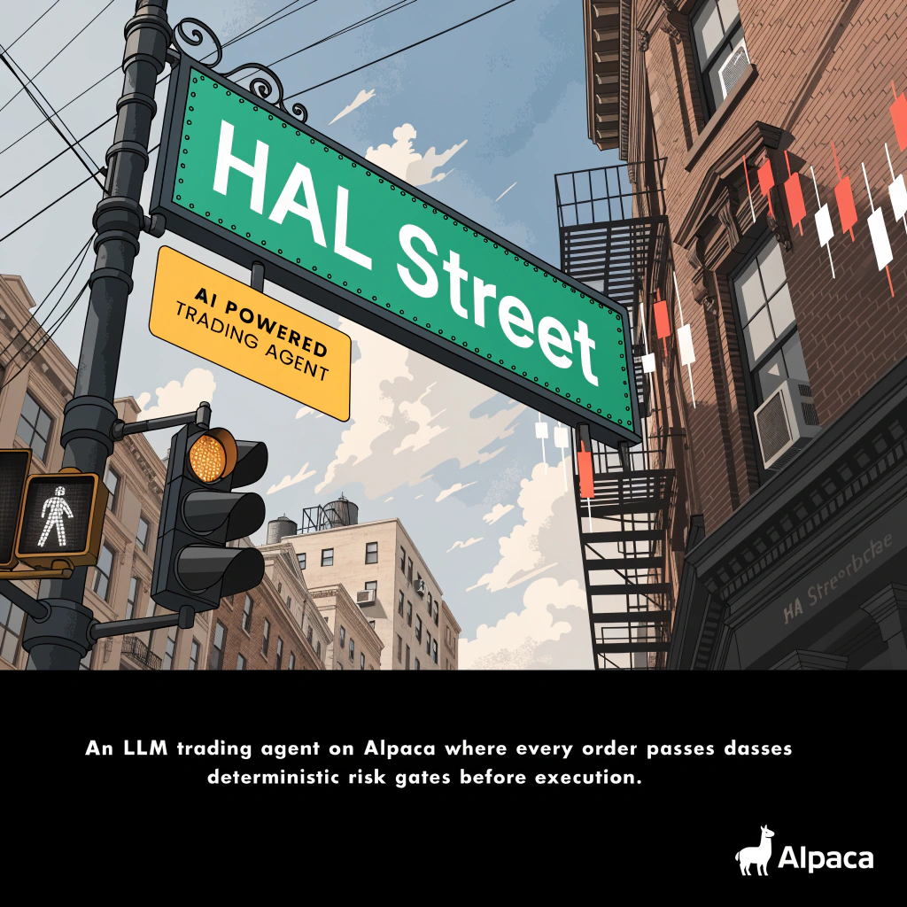

# HAL Street



An autonomous options trading agent built on Alpaca. The model proposes; deterministic gates dispose.

Submission for the Alpaca AI Trading Agents Hackathon (co-hosted with lablab.ai), main challenge
**Options Alpha Agents**. Runs entirely in Alpaca's paper trading environment.

---

## The idea in one paragraph

Most LLM trading agents let the model decide *and* execute. HAL Street splits those. A scanning
loop surfaces candidate option structures from a rules-based strategy engine; the LLM reasons over
them, ranks them, and writes a structured trade proposal; every proposal then passes through a
layer of deterministic risk gates written in plain Python — no model in the loop — before an order
is ever constructed. If a gate rejects, the trade dies, and the rejection reason is logged as part
of the run journal. The model can be wrong, hallucinate a strike, or get talked into something
stupid; it still cannot put on an undefined-risk position or exceed a per-underlying cap.

## Hackathon requirements → where they live

| Requirement | Implementation | Module |
|---|---|---|
| Autonomous AI trading agent | Scan → propose → gate → execute → manage loop, runs unattended on a schedule | `agent/` |
| Alpaca MCP server *or* CLI | All broker interaction goes through Alpaca's MCP server; nothing calls the REST API directly | `execution/` |
| Options trading | Defined-risk multi-leg structures only — put/call credit spreads and iron condors. Calendars and diagonals are excluded by construction: `defined_risk_only` and Alpaca's 4-leg ceiling between them rule out everything wider. | `strategy/` |
| Paper trading environment | `ALPACA_ENV=paper` enforced at startup; a gate refuses to run against live keys | `gates/` |
| Demonstrable P&L | Per-trade and cumulative P&L journal, exportable for the demo | `telemetry/` |
| Fresh account, $100k balance | Enforced by preflight; judged run refuses a dirty account | `src/halstreet/execution/preflight.py` |
| One-page write-up | AI logic / risk gates / Alpaca infrastructure | `docs/WRITEUP.md` |
| Build in public (extra) | Five-post plan, links logged as you go | `docs/BUILD-IN-PUBLIC.md` |

## Architecture

```
  market data ──► strategy engine ──► candidate structures
                  (deterministic)              │
                                               ▼
                                      ┌─────────────────┐
                                      │   LLM agent     │  ranks, sizes, writes
                                      │  (proposal)     │  a structured proposal
                                      └────────┬────────┘
                                               │  TradeProposal (typed)
                                               ▼
                                      ┌─────────────────┐
                                      │  RISK GATES     │  deterministic, no model
                                      │  pass / reject  │  reject → journal, stop
                                      └────────┬────────┘
                                               │
                                               ▼
                                    Alpaca MCP ──► paper account
                                               │
                                               ▼
                                    position manager (rolls, closes, expiry)
```

The boundary that matters is the one between the proposal and the gates. Everything above it is
probabilistic. Everything below it is auditable.

### What the deterministic side computes before anybody argues

The model is never asked to estimate something arithmetic can answer. Each candidate arrives
already carrying:

- **Simulated outcomes, at two volatilities.** Twenty thousand paths to expiry, after friction,
  priced once at the implied vol the short strike was actually quoted at and once at the vol the
  tape has been running. Where those agree it is a conclusion; where they disagree it *is* the
  trade, because short premium pays exactly when implied exceeds what realizes. Neither is
  averaged into the other. It refuses to run on a volatility nobody measured rather than
  defaulting to one — a structure simulated at a made-up 20% would arrive on the menu looking
  identical to a measured one.
- **Persistence.** A first-order chain over daily direction, and mostly it says *no*: on every
  name measured it forgets where it started within two days, so a 49-DTE structure cannot be
  argued on it at all. That refusal is the contribution. The threshold scales with sampling
  error, because a flat one labelled a random walk "persistent" at the first attempt.
- **Market structure.** Where price last broke a confirmed swing, which is the one reading in the
  bias vote about a level rather than an average of closes. It votes on what reaches the menu and
  is structurally unable to reach an exit.
- **Macro odds.** What a prediction market charges for the questions the headlines argue about —
  a price rather than prose. Read-only and not tradeable by this agent, which trades US equity
  options and nothing else.

The catalyst is told a price outranks a claim about the same question. It was handed the Fed-hike
market at 50.5 cents beside a wire reporting "odds now favour a hike" and quoted the wire, because
nothing had said which kind of evidence a price is.

### Between submitting an order and holding a position

There is a third path beside entry and exit, and its absence cost a live morning. The agent used
to submit a `day` limit and forget the order existed — one spread rested unfilled for an hour
while a second went on top of it, and the ledger carried both as positions.

Every pass now settles each working order first: filled is recorded at the price it actually
filled at, cancelled or expired is *forgotten* rather than closed, and one still resting past its
grace is withdrawn — which returns it to the ordinary path, where the next cycle prices it off
fresh quotes and puts it back through the whole scenario and gate chain. A partial fill is never
withdrawn: half a spread is an unbalanced position, and cancelling the remainder leaves naked
legs. The concentration gates count committed contracts too, because an order you have placed is
exposure whether or not the broker has booked it.

## Layout

```
src/halstreet/
  agent/        the agent, by brain region (HAL's naming)
    cortex/       the model: proposal writer, committee, response schema
    cerebellum/   the cycle, and the exit policy
    brainstem/    schedule, single-instance lock, circuit breaker
    hippocampus/  the structure ledger, and reading a soak back
  gates/        deterministic risk gates — the safety layer
  strategy/     structure construction, and the six-term ranking that orders them
  marketdata/   chains, quotes, IV, greeks
  execution/    Alpaca MCP client, order construction, fills
  telemetry/    run journal, P&L tracking, competition scoring export
apps/desktop/   read-only panel: React + TS + Tauri, pushed over a send-only WebSocket
scripts/        one-off runners, backfills, competition harness
tests/          gate tests are the ones that matter — see docs/TESTING.md
```

## Market data, and the OPRA caveat

Options quotes and greeks come from Alpaca, not a second vendor. `get_option_chain` returns
`greeks` and `impliedVolatility` alongside the NBBO fields, so there is no local Black-Scholes in
the live path.

Two limits are worth knowing before reading any P&L number this repo produces.

**The feed.** Alpaca offers two options feeds. `indicative` is free and is what `ALPACA_OPTION_FEED`
defaults to; `opra` is the official OPRA consolidated feed and requires a paid market-data
agreement on the account — request it without one and you get HTTP 403, not an empty result.
Indicative quotes are not the official NBBO, so paper fills here can diverge from what a real
consolidated feed would have given. Whichever feed produced a result is recorded in the run
journal, and the write-up states it plainly rather than leaving a judge to discover it.

**Greeks are not universal.** On a live SPY chain of 1,322 contracts, 94.6% carried greeks and IV.
The 72 that did not were all deep in or out of the money — strike/spot from 0.49 to 1.20 — where
inverting Black-Scholes for implied volatility is ill-conditioned. Separately, 0DTE contracts have
no greeks at all: the model carries time-to-expiry in its denominator, so at same-day expiry they
are indeterminate rather than merely missing.

Both shape the gates. The delta and vega gates **fail closed on a missing greek** — a proposal
whose legs cannot be risk-assessed is a proposal to reject, never one to wave through. And the
`MIN_DTE` floor turns out to do double duty: it is a risk gate in its own right, and it is also
what guarantees the greeks the other gates depend on actually exist.

## Why this is a service, not a chat plugin

The competition scores an *autonomous* agent over a live window. A chat plugin only runs when a
human is in a session typing, which fails the requirement outright. So the agent is a headless
scheduled process that consumes Alpaca's MCP server as a client.

A conversational surface (`apps/claude-skill/`) and voice in/out were both scoped and then
**cut** — the directories are gone rather than left as stubs. Neither served the autonomous
path, and an empty folder in a repo reads as an unfinished feature rather than a decision. What
replaced them is `./start.sh panel`: a read-only telemetry view that shows what the agent is
doing without being another way to make it do something.

## The panel

`apps/desktop/` is a Vite + React + TypeScript app — a browser tab at `http://127.0.0.1:8787`,
or the same page in a Tauri window. Seven views, on the number keys: the **console** (equity, a
live countdown to the next scan or the bell, the book, and the run's own figures), **agent**
(this scan name by name, each one's track through tape → menu → desk → gates → order, plus the
macro odds and the raw journal pulse), **journal** (every decision at full width), **discovery**
(the census as a heat map — every symbol the tape named, brightest where it named most),
**gates** (the chain in evaluation order, with how often each has actually rejected something),
**committee** (the desk while it sits, filling in seat by seat, with the menu it was handed), and
**book** (every structure, open and closed, each with its own chart). An equity curve runs on
`lightweight-charts`.

A position and a working order are drawn differently, which took a live morning to learn: the
ledger records on *acceptance*, so the book carries orders the broker has not filled, and one
badge for both had a resting spread reading as money already at work.

The Python server pushes over a WebSocket, so the panel updates within half a second of the
agent writing a record rather than on a five-second poll.

**It cannot trade, and that is enforced rather than intended.** Every HTTP route is a GET. The
socket is *send-only*: the server never calls `receive` and the client never calls `send`, so a
crafted frame has no code to reach. The Tauri shell registers no commands and holds no
capability beyond a window, which means the desktop build is a nicer frame around the identical
unprivileged page. `tests/telemetry/test_panel.py` and `test_server.py` assert all of it, and
each assertion was checked by reintroducing the defect it forbids.

```bash
./install.sh              # venv, deps, .env, and the panel bundle
./install.sh --desktop    # ...and the system libraries the Tauri window needs
./start.sh panel          # http://127.0.0.1:8787

cd apps/desktop
npm run dev               # Vite on :1420, hot reload, proxies /api and /ws to 8787
npm run tauri:dev         # the same page in a native window
```

The desktop window is the only thing here that needs packages from outside this directory —
WebKitGTK on Linux, because Tauri renders through the OS web view instead of shipping a
browser. That is why it is a flag: a repo installer should not reach for `sudo` unless it was
asked to. `./install.sh --desktop` knows the package names for apt, dnf, pacman and zypper, and
on macOS and Windows there is nothing to install. Without it, everything still works — the
panel in a browser is the same page.

Source layout: `views/` one file per screen, `components/` presentational, `hooks/` all derived
state, `lib/` pure functions with no React, `stores/` zustand (`connection` holds the snapshot,
`ui` holds what you are looking at), `constants/` every string, colour and class the app uses.
Nothing in a `.tsx` file computes anything or spells a sentence.

## Configuration

**There is one config file: `.env`.** Copy it from `.env.example` (or run `./install.sh`, which
does it for you) and fill in your paper keys. Nothing else is read — no `.env.local`, no
per-environment file, no profile directory.

The hackathon needs two Alpaca accounts, though: a dev account you break things on, and a
brand-new judged account that must stay clean. Both live in that one file, separated by
**variable name** rather than by filename:

| Account | Selected by | Reads |
|---|---|---|
| dev | the default | `ALPACA_API_KEY`, `ALPACA_SECRET_KEY` |
| judged | `--env comp` | `COMP_ALPACA_API_KEY`, `COMP_ALPACA_SECRET_KEY` |

Everything else in the file — risk limits, universe, scan cadence, LLM settings — is shared, which
is the point: the judged run uses the same gates and the same numbers as every rehearsal.

The two credential pairs never fall back to each other. A dev run never reads a `COMP_` name, so it
cannot reach the judged account by accident; a `--env comp` run with those names blank refuses to
start rather than quietly using the dev pair. And because both pairs now sit in one file, the
loader can check the thing that actually goes wrong — the same account pasted under both names —
which it refuses outright. (This was two files, `.env` and `.env.comp`; they bought nothing the
prefix did not already guarantee, drifted apart, and hid that check.)

Leave the `COMP_` values blank until the competition account exists. Blank is what stops a judged
run from starting early. See [docs/COMPETITION-ACCOUNT.md](docs/COMPETITION-ACCOUNT.md).

`.env` is gitignored; `.env.example` is the only version that ships.

## Running it

```bash
./install.sh                  # venv, deps, .env from the template
                              # then fill in ALPACA_API_KEY / ALPACA_SECRET_KEY

./start.sh -- --once          # one scan + propose pass, submits nothing
./start.sh                    # the scheduled loop, dev account
./start.sh -- --submit        # ...and actually place approved orders (paper)
./start.sh watch -- --submit  # the loop and the panel together, browser opened
./start.sh panel              # read-only dashboard on http://127.0.0.1:8787
./start.sh report -- --offline  # P&L and gate counts from the journal
./start.sh stop               # stop every agent and panel this project started

# judged run — refuses to start unless the account is fresh and at $100,000
./start.sh preflight --env comp
./start.sh --env comp -- --submit
```

**Stopping it.** Ctrl-C is three states, not one: the first press finishes the cycle in flight,
because a scan interrupted between the gate chain and the broker is how a structure ends up half
placed; the second abandons that cycle; the third leaves immediately. A cycle over six discovered
names is four model calls each and can run past four minutes, so the agent says which state it is
in on every press — and `tee` ignores the interrupt so those lines survive to be read.

`./start.sh stop` is the answer when Ctrl-C cannot reach it at all: a panel started detached sits
in nobody's terminal. It matches the module path under a python interpreter rather than the word
`halstreet`, which also appears in the shell you type the command into, and it runs above the
credential checks and the venv probe — this is the command you reach for when things are wrong,
and every prerequisite is a way for it to refuse at the moment it is needed.

`./start.sh` refuses to launch on a non-paper `ALPACA_ENV` or a live `AK…` key before it does
anything else; the Python path asserts the same at every order. The underlying commands are
`python -m halstreet.agent.run` and `python -m halstreet.cli.preflight` if you would rather call them
directly — the launcher exists to put `uv` on `PATH` for the MCP subprocess and to tee to
`var/log/halstreet.log`.

## Where things are

```
src/halstreet/     the agent — see Layout above
apps/desktop/      the panel: React + TypeScript, Tauri shell, Vite build
scripts/           entry points: preflight, report, panel, verify_multileg
tests/             1718 tests; the gate tests are the ones that matter
docs/              write-up, testing notes, competition rules, build log
var/               everything the agent writes — gitignored
```

`var/` holds all mutable state: `var/journal/` (the append-only run journal, the structure
ledger, the circuit latch) and `var/log/`. Nothing a human edits lives there and nothing the
agent writes lives anywhere else, so `rm -rf var/` is a complete reset and one `.gitignore` line
covers it. `src/halstreet/paths.py` owns those locations — set `HALSTREET_VAR` to move them.

## Status

Working end to end on the dev paper account: discovers its own universe from the tape, scans,
simulates, deliberates, gates, submits, works its orders, reconciles and reports. Two round trips
have been through the whole path, and the ledger reconciles clean against the broker.

The sizing is honest about itself. `MAX_POSITIONS_PER_UNDERLYING` caps *contracts*, not
structures, so it **is** the maximum qty — at the shipped default of 1, the best structure the
desk found in a week was $54 of risk against a $1,000 cap for $46 of max gain, which is 0.05% of
the account for a 49-day hold. The per-position dollar cap was doing nothing and the contract cap
was doing the risk control's job about eighteen times too tightly. They now work together: size is
`min(cap_contracts, dollar_cap / risk-per-contract)`.

Still ahead: the judged account (external lead time), a multi-session soak, the demo video, and a
price for the analyst-tier model in `LLM_PRICES` — until that is set the reported cost is a floor
and the panel says so beside it rather than quietly omitting two thirds of the input.

One known gap: `get_orders` returns nothing whatever status filter is passed, so the order book
cannot be enumerated. Nothing depends on it — the fill path looks orders up by id — but it means
"no other orders are outstanding" is currently a reconciliation result rather than a direct
reading.

`docs/MIGRATION.md` is the build log — what came from HAL and TradeScans, what was written new,
every defect found on the way and what changed because of it.
